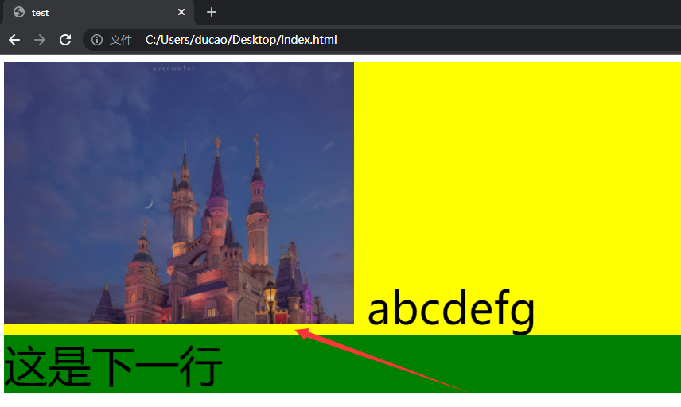
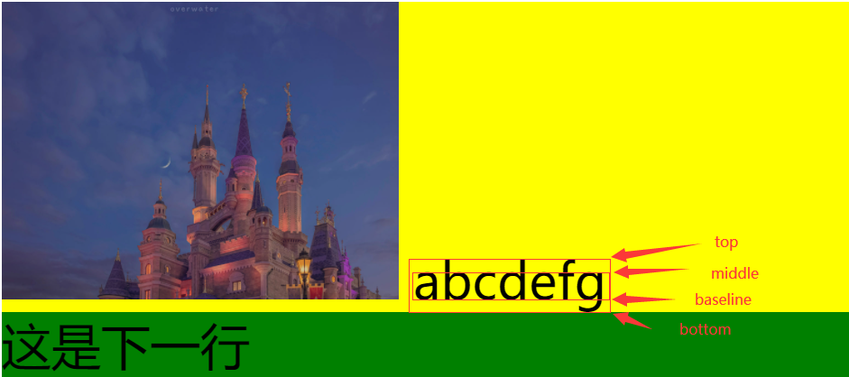

# 关于图片下方空白的原因和解决方案

## 问题描述：
> 在编写页面的时候，会出现图片和下方文字之间出现一条空白的区域（如下图），并非是图片的边框，无法去除。  

  

代码片段：
```html
<!DOCTYPE html>
<html lang="en">
  <head>
    <meta charset="utf-8" />
    <title>test</title>
  </head>
  <style>
    .main{
      background-color: yellow;
      font-size: 50px;
    }
    .next-line{
      color: black;
      background-color: green;
    }
    img{
      width: 400px;
    }
  </style>
  <body>
    <div class="main">
      
      abcdefg
      <div class="next-line">
        这是下一行
      </div>
    </div>
  </body>
</html>
```
## 问题原因：
> img标签为行内元素，所以有“四线”（参考[此处](https://kinboyw.github.io/2018/11/02/CSS-line-height/)介绍），空白处为基线和底线之间的空白 



## 解决方案：
1. 将img转化为块级元素
```css
img{
      width: 400px;
      display: block;
    }
```
2. 将img的对其方式改为top、middle或者baseline（三选一即可）
```css
img{
      width: 400px;
      vertical-align: top;
      vertical-align: baseline;
      vertical-align: middle;
    }
```