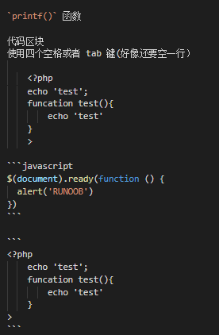

# 关于 markdown 的一些基础语法

## 一级标题

```
# 这是一级标题
```

## 二级标题

```
## 这是二级标题
```

## 三级标题

```
### 这是三级标题
```

## 段落

> 这是文本段落  
> 这是第二段  
> 段位两个及以上空格加 enter 可以换行
> 不满足空格数不会换行

```
> 这是文本段落
> 这是第二段
> 段位两个及以上空格加 enter 可以换行
> 不满足空格数不会换行
```

## 换行

空行也可以实现换行
，但是回重现起一个块

## 斜体

_斜体文字_

```
_斜体文字_
```

## 粗体

**粗体文字**
**粗体文字**

```
**粗体文字**
**粗体文字**
```

## 粗斜体

**_粗斜体文字_**
**_粗斜体文字_**

```
**粗体文字**
**粗体文字**
```

## 分割线

---

---

---

三个以上的\*、-、\_为分隔线

```
---

---

---
```

## 删除线

~~删除线~~

```
~~删除线~~
```

## 下划线

<u>下划线"/u"可省略</u>

```
<u>下划线"/u"可省略</u>
```

## markdown 列表

- 第一项
- 第二项
- 第三项

> 使用\*、-、+来作为列表标记

1. 第一个有序项
2. 第二个有序项
   - 嵌套元素
   - 嵌套元素二

> 区块应用标识
>
> > 第二层区块
> >
> > > 第三层区块

```
- 第一项
- 第二项
- 第三项

> 使用\*、-、+来作为列表标记

1. 第一个有序项
2. 第二个有序项
   - 嵌套元素
   - 嵌套元素二

> 区块应用标识
>
> > 第二层区块
> >
> > > 第三层区块
```

## 代码包裹

`printf()` 函数

代码区块  
使用四个空格或者 tab 键(好像还要空一行）

    <?php
    echo 'test';
    funcation test(){
        echo 'test'
    }
    >

```javascript
$(document).ready(function () {
  alert('RUNOOB')
})
```

```
<?php
    echo 'test';
    funcation test(){
        echo 'test'
    }
>
```



## 链接

这是一个链接 [ducaoya](http://ducaoya.ml)

<http://ducaoya.ml>

这个链接用 1 作为网址变量 [ducaoya][1]
这个链接用 runoob 作为网址变量 [ducaoya][ducaoya]
然后在文档的结尾为变量赋值（网址）

[1]: http://ducaoya.ml
[ducaoya]: http://ducaoya.ml

```
这是一个链接 [ducaoya](http://ducaoya.ml)

<http://ducaoya.ml>

这个链接用 1 作为网址变量 [ducaoya][1]
这个链接用 runoob 作为网址变量 [ducaoya][ducaoya]
然后在文档的结尾为变量赋值（网址）

[1]: http://ducaoya.ml
[ducaoya]: http://ducaoya.ml

```

## 图片


```

```

## 表格

---

| 表头   | 表头   |
| ------ | ------ |
| 单元格 | 单元格 |
| 单元格 | 单元格 |

-: 设置内容和标题栏居右对齐。
:- 设置内容和标题栏居左对齐。
:-: 设置内容和标题栏居中对齐。

| 左对齐          |        右对齐 |    居中对齐    |
| :-------------- | ------------: | :------------: |
| 单元格 -------- | 单元格 ------ | 单元格 ------- |
| 单元格          |        单元格 |     单元格     |

```
---

| 表头   | 表头   |
| ------ | ------ |
| 单元格 | 单元格 |
| 单元格 | 单元格 |

-: 设置内容和标题栏居右对齐。
:- 设置内容和标题栏居左对齐。
:-: 设置内容和标题栏居中对齐。

| 左对齐          |        右对齐 |    居中对齐    |
| :-------------- | ------------: | :------------: |
| 单元格 -------- | 单元格 ------ | 单元格 ------- |
| 单元格          |        单元格 |     单元格     |
```

## 其他

`目前支持的 HTML 元素有：<kbd> <b> <i> <em> <sup> <sub> <br>等 ，如：`
使用 <kbd>Ctrl</kbd>+<kbd>Alt</kbd>+<kbd>Del</kbd> 重启电脑

```
`目前支持的 HTML 元素有：<kbd> <b> <i> <em> <sup> <sub> <br>等 ，如：`
使用 <kbd>Ctrl</kbd>+<kbd>Alt</kbd>+<kbd>Del</kbd> 重启电脑

```

Markdown 支持以下这些符号前面加上反斜杠来帮助插入普通的符号：

````\ 反斜线
`   反引号
*   星号
_   下划线
{}  花括号
[]  方括号
()  小括号
#   井字号
+   加号
-   减号
.   英文句点
!   感叹号```
````
