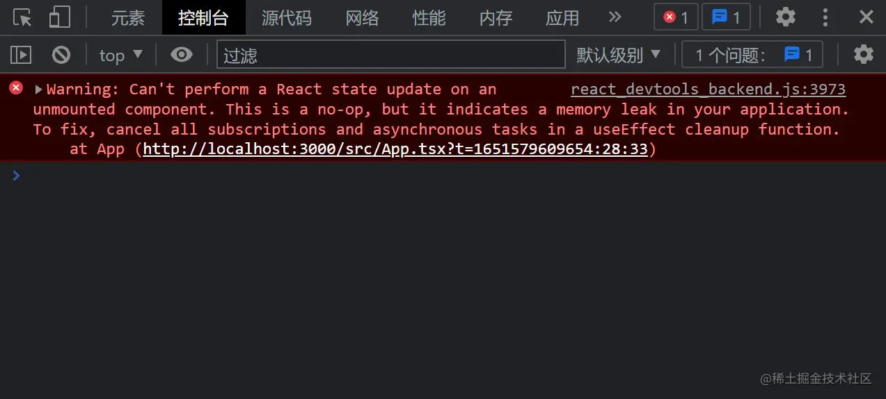

# React 18 新特性学习记录

> 在 2021 年 6 月份，`React 18 Working Group`（`React 18` 工作组，简称 `reactwg`）成立了，并且公布了 `v18` 版本的发布计划，经过将近一年的迭代和准备，在 2022 年 3 月 29 日，`React 18` 正式版终于发布了。详情可参考 [React 官方博客](https://reactjs.org/blog/2022/03/29/react-v18.html)

**注意** : `React 18` 已经放弃了对 `ie11` 的支持，将于 2022 年 6 月 15 日 停止支持 `ie` ，如需兼容，需要回退到 `React 17` 版本。

## Render API

为了更好的管理 `root` 节点，`React 18` 引入了一个新的 `root API`，新的 `root API` 还支持` new concurrent renderer（并发模式的渲染）`，它允许你进入 `concurrent mode`（并发模式）。

```tsx
// React 17
import React from "react";
import ReactDOM from "react-dom";
import App from "./App";

const root = document.getElementById("root")!;

ReactDOM.render(<App />, root);

// React 18
import React from "react";
import ReactDOM from "react-dom/client";
import App from "./App";

const root = ReactDOM.createRoot(
  document.getElementById("root") as HTMLElement
);
root.render(<App />);
```

> tips : `React 18` 是兼容 `React 17` 的，所以在 `React 18` 中使用旧版本的 Render API 依旧是可行的，但是在控制台会出现一个警告 ⚠，如果希望使用 `React 17` 的 API 可以互虐该警告。
> 这也表示可以将 `React 17` 的项目直接升级到 `React 18` 而不会产生不兼容的情况。

## Concurrent Mode（并发模式）

`Concurrent Mode`（以下简称 `CM`）翻译叫并发模式，这个概念我们或许已经听过很多次了，实际上，在去年这个概念已经很成熟了，在` React 17` 中就可以通过一些试验性的 api 开启 `CM` 。

`CM 本身并不是一个功能，而是一个底层设计 `

并发模式可帮助应用保持响应，并根据用户的设备性能和网速进行适当的调整，该模式通过使渲染可中断来修复阻塞渲染限制。在 `Concurrent` 模式中，`React` 可以同时更新多个状态。

总结一句话就是：  
`React 17 和 React 18 的区别就是：从同步不可中断更新变成了异步可中断更新。`

在文章开始提到过：在 `React 18` 中，提供了新的 `root api`，我们只需要把 `render` 升级成 `createRoot(root).render(<App />)` 就可以开启并发模式了。

`并发特性`指开启`并发模式`后才能使用的特性，比如：

- `useDeferredValue`
- `useTransition`


### 并发特性：

#### startTransition

```tsx
import React, { useState, useEffect, useTransition } from "react";

const App: React.FC = () => {
  const [list, setList] = useState<any[]>([]);
  const [isPending, startTransition] = useTransition();
  useEffect(() => {
    // 使用了并发特性，开启并发更新
    startTransition(() => {
      setList(new Array(10000).fill(null));
    });
  }, []);
  return (
    <>
      {list.map((_, i) => (
        <div key={i}>{i}</div>
      ))}
    </>
  );
};

export default App;
```

> 由于 `setList` 在 `startTransition` 的回调函数中执行（使用了`并发特性`），所以 `setList` 会触发`并发更新`。
>
> `startTransition`，主要为了能在大量的任务下也能保持 UI 响应。这个新的 API 可以通过将特定更新标记为`“过渡”`来显著改善用户交互，简单来说，就是被 `startTransition` 回调包裹的 `setState` 触发的渲染被标记为不紧急渲染，这些渲染可能被其他`紧急渲染`所抢占。
>
> - 有关 `startTransition` 的更多信息，请参阅 [Patterns for startTransition](https://link.juejin.cn/?target=https%3A%2F%2Fgithub.com%2Freactwg%2Freact-18%2Fdiscussions%2F100)。

#### useDeferredValue

返回一个延迟响应的值，可以让一个 state 延迟生效，只有当前没有紧急更新时，该值才会变为最新值。useDeferredValue 和 startTransition 一样，都是标记了一次非紧急更新。
从介绍上来看 useDeferredValue 与 useTransition 是否感觉很相似呢？

- 相同：useDeferredValue 本质上和内部实现与 useTransition 一样，都是标记成了延迟更新任务。
- 不同：useTransition 是把更新任务变成了延迟更新任务，而 useDeferredValue 是产生一个新的值，这个值作为延时状态。（一个用来包装方法，一个用来包装值）

```tsx
import React, { useState, useEffect, useDeferredValue } from "react";

const App: React.FC = () => {
  const [list, setList] = useState<any[]>([]);
  useEffect(() => {
    setList(new Array(10000).fill(null));
  }, []);
  // 使用了并发特性，开启并发更新
  const deferredList = useDeferredValue(list);
  return (
    <>
      {deferredList.map((_, i) => (
        <div key={i}>{i}</div>
      ))}
    </>
  );
};

export default App;
```

### 结论

- 并发更新的意义就是`交替执行`不同的任务，当预留的时间不够用时，`React` 将线程控制权交还给浏览器，等待下一帧时间到来，然后继续被中断的工作
- `并发模式`是实现`并发更新`的基本前提
- `时间切片`是实现`并发更新`的具体手段
- 上面所有的东西都是基于 `fiber` 架构实现的，`fiber`为状态更新提供了可中断的能力

### 关于 fiber，有三层具体含义：

- 作为架构来说，在旧的架构中，Reconciler（协调器）采用递归的方式执行，无法中断，节点数据保存在递归的调用栈中，被称为 Stack Reconciler，stack 就是调用栈；在新的架构中，Reconciler（协调器）是基于 fiber 实现的，节点数据保存在 fiber 中，所以被称为 fiber Reconciler。

- 作为静态数据结构来说，每个 fiber 对应一个组件，保存了这个组件的类型对应的 dom 节点信息，这个时候，fiber 节点就是我们所说的虚拟 DOM。

- 作为动态工作单元来说，fiber 节点保存了该节点需要更新的状态，以及需要执行的副作用。

## React.FC 隐式参数 children 需要显式定义

如果项目使用了 `TypeScript` ，最值得注意的变化是，现在在定义 `props` 类型时，如果需要获取子组件 `children`，那么你需要显式的定义它，例如这样：

```tsx
// React 17
interface MyButtonProps {
  color: string;
}

const MyButton: React.FC<MyButtonProps> = ({ children }) => {
  // 在 React 17 的 FC 中，默认携带了 children 属性
  return <div>{children}</div>;
};

export default MyButton;

// `React 18`
interface MyButtonProps {
  color: string;
  children?: React.ReactNode;
}

const MyButton: React.FC<MyButtonProps> = ({ children }) => {
  // 在 `React 18` 的 FC 中，不存在 children 属性，需要手动申明
  return <div>{children}</div>;
};

export default MyButton;
```

## setState 自动批处理

`React 18` 通过在默认情况下执行批处理来实现了开箱即用的性能改进。

批处理是指为了获得更好的性能，在数据层，将`多个状态更新`批量处理，合并成`一次更新`（在视图层，将`多个渲染`合并成`一次渲染`）。

### 在 React 18 之前

在`React 18` 之前，我们只在 `React` 事件处理函数(如 `React` 点击事件)中进行批处理更新。默认情况下，在`promise`、`setTimeout`、`原生事件处理函数`中、或任何其它事件内的更新都不会进行批处理：

1.  在 React 事件中

```tsx
import React, { useState } from "react";

// React 18 之前
const App: React.FC = () => {
  console.log("App组件渲染了！");
  const [count1, setCount1] = useState(0);
  const [count2, setCount2] = useState(0);
  return (
    <button
      onClick={() => {
        setCount1((count) => count + 1);
        setCount2((count) => count + 1);
        // 在React事件中被批处理
      }}
    >
      {`count1 is ${count1}, count2 is ${count2}`}
    </button>
  );
};

export default App;
```

> 每次点击更新`两个状态`，每次更新组件也只`渲染一次`。

1. 在 promise 或者 setTimeout 中

```tsx
import React, { useState } from "react";

// React 18 之前
const App: React.FC = () => {
  console.log("App组件渲染了！");
  const [count1, setCount1] = useState(0);
  const [count2, setCount2] = useState(0);
  return (
    <div
      onClick={() => {
        setTimeout(() => {
          setCount1((count) => count + 1);
          setCount2((count) => count + 1);
        });
        // 在 setTimeout 中不会进行批处理
      }}
    >
      <div>count1： {count1}</div>
      <div>count2： {count2}</div>
    </div>
  );
};

export default App;
```

> 每次点击更新`两个状态`，组件都会`渲染两次`，不会进行批量更新。

3.  在原生事件中

```tsx
import React, { useEffect, useState } from "react";

// React 18 之前
const App: React.FC = () => {
  console.log("App组件渲染了！");
  const [count1, setCount1] = useState(0);
  const [count2, setCount2] = useState(0);
  useEffect(() => {
    document.body.addEventListener("click", () => {
      setCount1((count) => count + 1);
      setCount2((count) => count + 1);
    });
    // 在原生js事件中不会进行批处理
  }, []);
  return (
    <>
      <div>count1： {count1}</div>
      <div>count2： {count2}</div>
    </>
  );
};

export default App;
```

> 每次点击更新`两个状态`，组件都会`渲染两次`，不会进行批量更新。

### 在 React 18 中

在 `React 18` 上面的三个例子只会有一次 `render` ，因为所有的更新都将自动批处理。这样无疑是很好的提高了应用的整体性能。

**在下面情况中，依旧会渲染两次 :**

```tsx
import React, { useState } from "react";

// React 18
const App: React.FC = () => {
  console.log("App组件渲染了！");
  const [count1, setCount1] = useState(0);
  const [count2, setCount2] = useState(0);
  return (
    <div
      onClick={async () => {
        await setCount1((count) => count + 1);
        setCount2((count) => count + 1);
      }}
    >
      <div>count1： {count1}</div>
      <div>count2： {count2}</div>
    </div>
  );
};

export default App;
```

#### 总结

- 在 18 之前，只有在 react 事件处理函数中，才会自动执行批处理，其它情况会多次更新
- 在 18 之后，任何情况都会自动执行批处理，多次更新始终合并为一次

## flushSync

批处理是一个`破坏性改动`，如果你想退出批量更新，你可以使用 `flushSync` ：

```tsx
import React, { useState } from "react";
import { flushSync } from "react-dom";

const App: React.FC = () => {
  const [count1, setCount1] = useState(0);
  const [count2, setCount2] = useState(0);
  return (
    <div
      onClick={() => {
        flushSync(() => {
          setCount1((count) => count + 1);
        });
        // 第一次更新
        flushSync(() => {
          setCount2((count) => count + 1);
        });
        // 第二次更新
      }}
    >
      <div>count1： {count1}</div>
      <div>count2： {count2}</div>
    </div>
  );
};

export default App;
```

**注意**：flushSync 函数内部的多个 `setState` 仍然为批量更新，这样可以精准控制哪些不需要的批量更新。  
关于更多`批处理`和 `flushSync` 可参考 React 官方介绍[Automatic batching deep dive（批处理深度分析）](https://link.juejin.cn/?target=https%3A%2F%2Fgithub.com%2Freactwg%2Freact-18%2Fdiscussions%2F21)

## Suspense 不再需要 fallback 来捕获

在 `React 18` 的 `Suspense` 组件中，官方对 空的 `fallback` 属性的处理方式做了改变：不再跳过 `缺失值` 或 值为 `null` 的 `fallback` 的 `Suspense` 边界。相反，会捕获边界并且向外层查找，如果查找不到，将会把 `fallback` 呈现为 `null` 。

**更新前：**

以前，如果你的 `Suspense` 组件没有提供 `fallback` 属性， `React` 就会悄悄跳过它，继续向上搜索下一个边界

```tsx
// React 17
const App = () => {
  return (
    <Suspense fallback={<Loading />}> // <--- 这个边界被使用，显示 Loading 组件
      <Suspense>                      // <--- 这个边界被跳过，没有 fallback 属性
        <Page />
      </Suspense>
    </Suspense>
  );
};

export default App;

```

`React` 工作组发现这可能会导致混乱、难以调试的情况发生。例如，你正在 debug 一个问题，并且在没有 `fallback` 属性的 `Suspense` 组件中抛出一个边界来测试一个问题，它可能会带来一些意想不到的结果，并且 `不会警告` 说它 `没有fallback` 属性。

**更新后：**
现在，`React` 将使用当前组件的 `Suspense` 作为边界，即使当前组件的 `Suspense` 的值为 `null` 或 `undefined` ：

```tsx
// React 18
const App = () => {
  return (
    <Suspense fallback={<Loading />}> // <--- 不使用
      <Suspense>                      // <--- 这个边界被使用，将 fallback 渲染为 null
        <Page />
      </Suspense>
    </Suspense>
  );
};

export default App;

```

这个更新意味着我们`不再跨越边界组件`。相反，我们将在边界处捕获并呈现 `fallback` ，就像你提供了一个返回值为 `null` 的组件一样。这意味着被挂起的 `Suspense` 组件将按照预期结果去执行，如果忘记提供 `fallback` 属性，也不会有什么问题。

[关于 Suspense 的官方解释](https://link.juejin.cn/?target=https%3A%2F%2Fgithub.com%2Freactwg%2Freact-18%2Fdiscussions%2F72)

## 关于卸载组件时的更新状态警告

在开发时，偶尔会遇到以下错误：



> 这个错误表示：无法对未挂载（已卸载）的组件执行状态更新。这是一个无效操作，并且表明我们的代码中存在内存泄漏。
>
> 实际上，这个错误并不多见，在以往的版本中，这个警告被广泛误解，并且有些误导。
>
> 这个错误的初衷，原本旨在针对一些特殊场景，譬如 你在 useEffect 里面设置了定时器，或者订阅了某个事件，从而在组件内部产生了副作用，而且忘记 return 一个函数清除副作用，则会发生内存泄漏…… 之类的场景
>
> 但是在实际开发中，更多的场景是，我们在 useEffect 里面发送了一个异步请求，在异步函数还没有被 resolve 或者被 reject 的时候，我们就卸载了组件。 在这种场景中，警告同样会触发。但是，在这种情况下，组件内部并没有内存泄漏，因为这个异步函数已经被垃圾回收了，此时，警告具有误导性。
>
> 关于这点，React 官方也有解释：
>
> 
>
> 综上所述原因，在 React 18 中，官方删除了这个报错。
>
> 有关这个报错的更多信息，你可以参阅 React 官方的说明，点击[这里](https://link.juejin.cn/?target=https%3A%2F%2Fgithub.com%2Freactwg%2Freact-18%2Fdiscussions%2F82)查看。

## 参考资料

- [React v18.0](https://link.juejin.cn/?target=https%3A%2F%2Freact.docschina.org%2Fblog%2F2022%2F03%2F29%2Freact-v18.html)
- [How to Upgrade to React 18](https://link.juejin.cn/?target=https%3A%2F%2Freact.docschina.org%2Fblog%2F2022%2F03%2F08%2Freact-18-upgrade-guide.html)
- [React 18 工作组](https://link.juejin.cn/?target=https%3A%2F%2Fgithub.com%2Freactwg%2Freact-18%2Fdiscussions)
- [React 18 不再依赖 Concurrent Mode 开启并发更新了](https://link.juejin.cn/?target=https%3A%2F%2Fmp.weixin.qq.com%2Fs%2FtC2VF_uIZf4RfBWdlpaKUA)
- [React18 新特性解读 & 完整版升级指南](https://juejin.cn/post/7094037148088664078)
