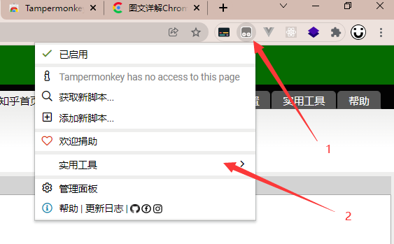

# 编写一个屏蔽知乎视频的 Tampermonkey(油猴)插件

## 下载 Tampermonkey

可前往 `chrome` 的 `WebStore` 自行下载（需特殊上网方式）  
[油猴插件下载地址](https://chrome.google.com/webstore/detail/tampermonkey/dhdgffkkebhmkfjojejmpbldmpobfkfo)  
[离线安装 chrome 插件方法](https://huajiakeji.com/utilities/2019-01/1791.html)

## 创建插件

1. 打开管理面板  
   
2. 创建插件脚本  
   
3. 编辑脚本（具体参数可以参考[油猴脚本编写教程](https://segmentfault.com/a/1190000021654926)）  
     
   
4. 修改
   

## 上传脚本

可以参考[油猴脚本编写教程](https://segmentfault.com/a/1190000021654926)
