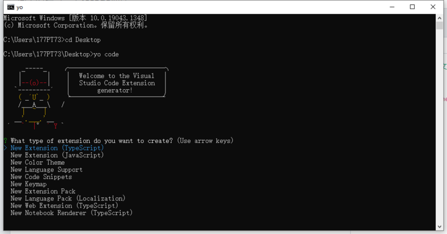
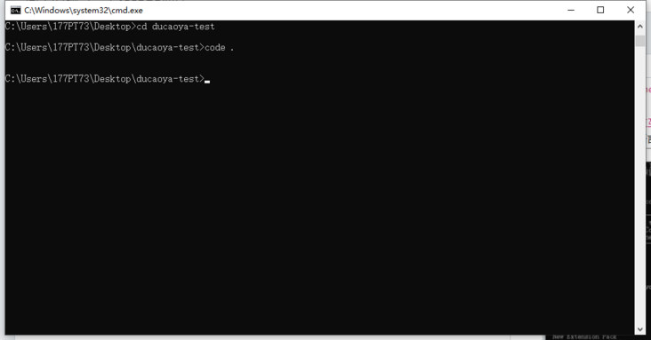
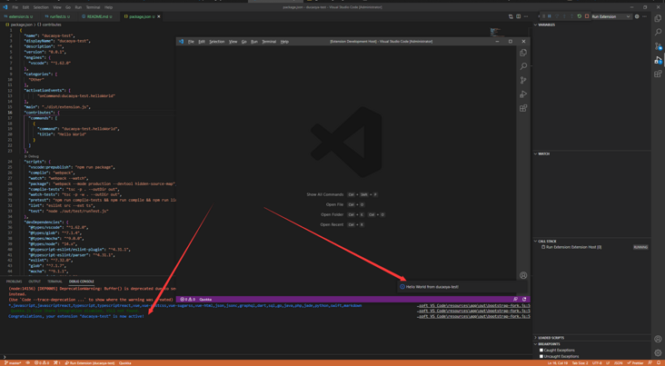

# 简单的编写一个 vscode 插件

更加详细的内容可以查看该文档！[vscode 插件开发文档（中文版）](https://github.com/Liiked/VS-Code-Extension-Doc-ZH)

## 安装脚手架

`npm install -g yo generator-code`

## 初始化一个插件

`yo code //会出现一个交互窗口提供一些初始化选项`
选择插件类型（开发语言等，基本无脑下一步即可）
  
 使用 vscode 打开项目  
 

## 文件目录结构

```
├── .eslintrc.json // eslint配置
├── .vscode // vscode调试配置
|  ├── extensions.json
|  ├── launch.json
|  ├── settings.json
|  └── tasks.json
├── .vscodeignore // 发布忽略内容
├── CHANGELOG.md // 修改日志
├── README.md // 插件发布后，插件主页内容
├── package-lock.json
├── package.json // vscode从这里识别插件贡献点
├── src // 核心源码内容
|  ├── extension.ts // 入口文件（主要修改此文件）
|  └── test //测试文件
├── tsconfig.json // ts配置文件
├── vsc-extension-quickstart.md
└── webpack.config.js // wepack配置

```

## 运行调试

先按`F5`进入 vscode 自带的调试窗口，接着按`ctrl+shift+P`在顶部出现命令框，输入`Hello World`,出现如下界面即完成了插件项目的创建  
 （输入 F5 即进入 vscode 自带调试模式，也可运行`npm run watch`或者点击工具栏调试器）  
 

## 发布

- 方法一：直接把文件夹发给别人，让别人找到 vscode 的插件存放目录并放进去，然后重启 vscode，一般不推荐；
- 方法二：打包成 vsix 插件，然后发送给别人安装，如果你的插件涉及机密不方便发布到应用市场，可以尝试采用这种方式；
- 方法三：注册开发者账号，发布到官网应用市场，这个发布和 npm 一样是不需要审核的。（可参考此文档发布流程，[vscode 插件开发中文文档](https://liiked.github.io/VS-Code-Extension-Doc-ZH/#/working-with-extensions/publish-extension))
